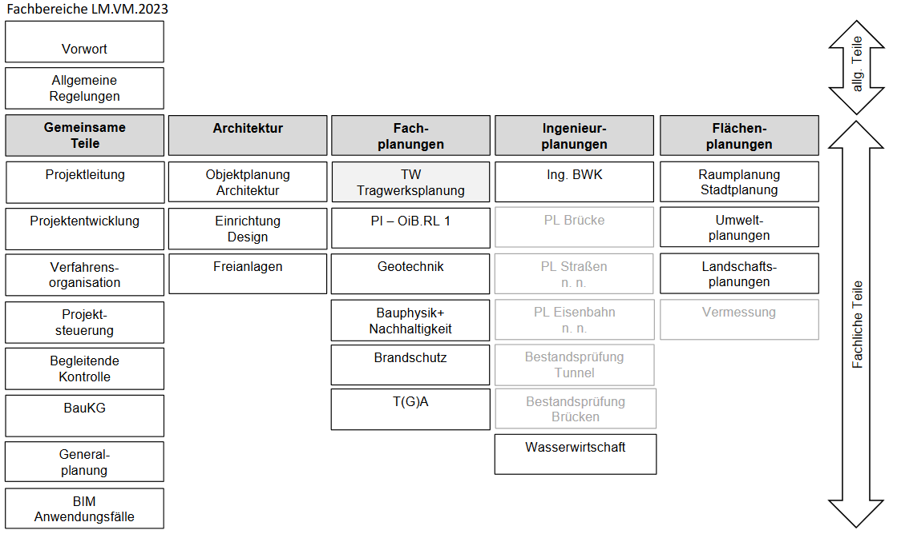
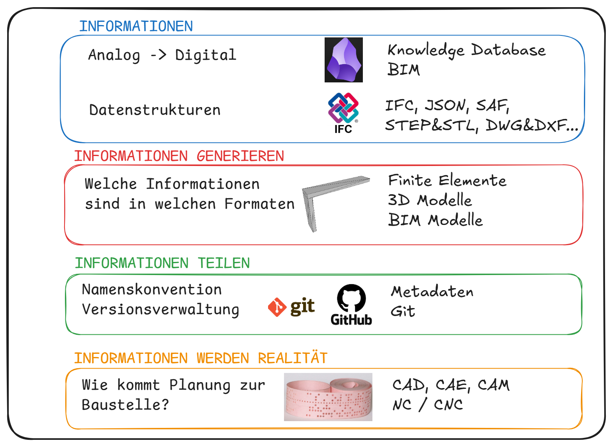
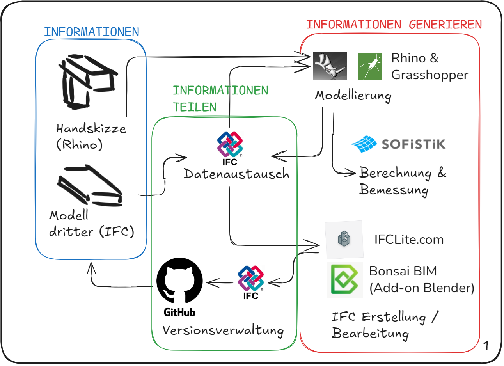
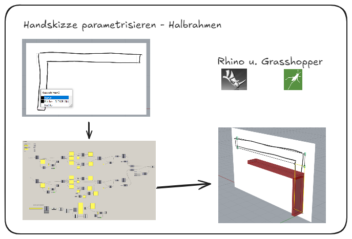
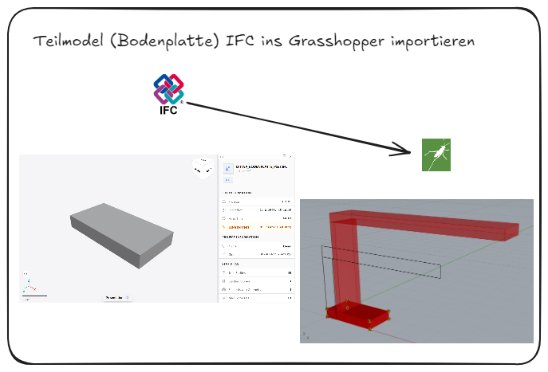
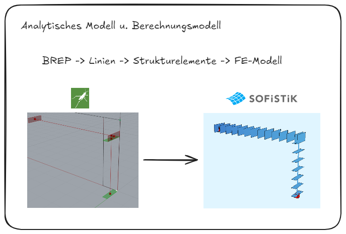
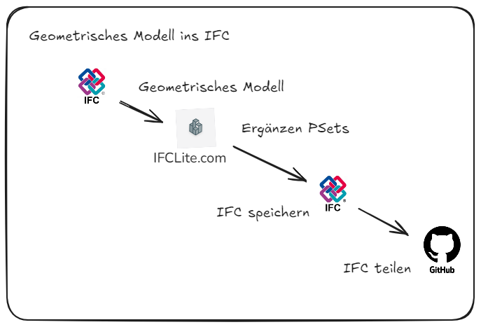

## Digitale Tragwerksplanung
### Vorlesung und Übung

---

## Was ist digitale Tragwerksplanung?

- Was ist digital? <!-- .element: class="fragment" data-fragment-index="2" -->
- Was ist Tragwerksplanung? <!-- .element: class="fragment" data-fragment-index="3" -->

--

## Was ist digital?

- Reliability - Zuverlässigkeit <!-- .element: class="fragment" data-fragment-index="2" -->
- Modularity - Modularität <!-- .element: class="fragment" data-fragment-index="3" -->
- Locality - Lokalität <!-- .element: class="fragment" data-fragment-index="4" -->
- Reversibility - Reversibilität <!-- .element: class="fragment" data-fragment-index="5" -->

<small class="attribution">Quelle: Gershenfeld - Designing Reality</small>
<!-- .element: class="fragment" data-fragment-index="5" -->

--

## Was ist Tragwerksplanung?

<figcaption>
(Bildquelle: Lechner LM.VM.2023)
</figcaption>

--

## Was ist Tragwerksplanung?

- Bestandteil der Fachplanung <!-- .element: class="fragment" data-fragment-index="2" -->
- "Statik" <!-- .element: class="fragment" data-fragment-index="3" -->
- Eng mit Objektplanung verknüpft <!-- .element: class="fragment" data-fragment-index="4" -->

--

#### Was ist digitale Tragwerksplanung?

## Zuverlässigkeit

Analoge Informationen → Digitale Informationen

--

#### Was ist digitale Tragwerksplanung?

## Modularität

Zerlegen der Planung, Bauwerke, Bauteile in kleinere Teile, die aber leicht verknüpft werden können.

--

#### Was ist digitale Tragwerksplanung?

## Lokalität

Informationen müssen auch von "unten" nach "oben" fließen können.

--

#### Was ist digitale Tragwerksplanung?

## Reversibilität

Änderungen und Korrekturen sind möglich  
(und leicht zu implementieren und kommunizieren).

---

## Aufbau der LVA (VO u. UE)

1. Informationen erheben und strukturieren <!-- .element: class="fragment" data-fragment-index="2" -->
2. Informationen generieren <!-- .element: class="fragment" data-fragment-index="3" -->
3. Informationen teilen <!-- .element: class="fragment" data-fragment-index="4" -->
4. Informationen werden Realität <!-- .element: class="fragment" data-fragment-index="5" -->

--

#### Ablauf Vorlesung

--

#### Ablauf Übung

--

--

--

--

