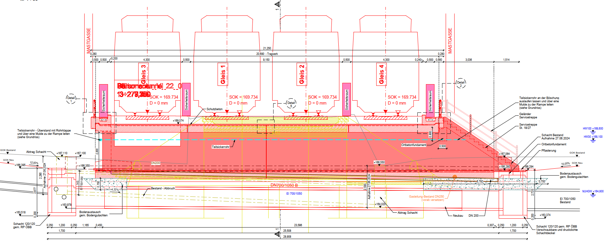
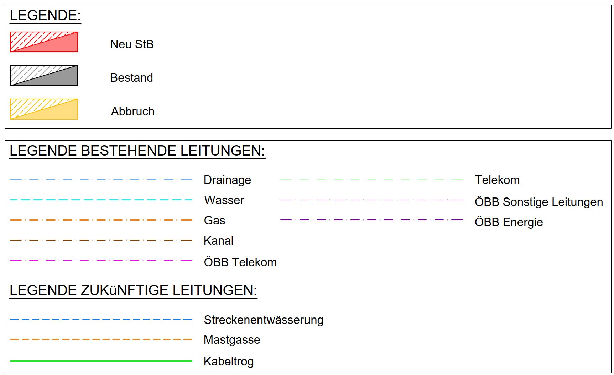

## Digitale Tragwerksplanung
### Geometriemodell, BIM-Modell, FE-Modell,...

**Welche Informationen trägt welches Modell?**

Note:
Leitfrage der Vorlesung: Zwei Modelle können geometrisch ähnlich aussehen und trotzdem völlig unterschiedliche Informationen tragen. Entscheidend ist nicht nur die sichtbare Form, sondern die Datenstruktur und der Zweck des Modells.

---

## Ein Bauwerk – verschiedene Modelle

<div class="three-col">
  <div class="card fragment">
    <h6>Geometriemodell</h6>
    <p>Form, Lage, Abmessungen,...</p>
  </div>

  <div class="card fragment">
    <h6>BIM-Modell</h6>
    <p>Klassen, Eigenschaften, Beziehungen, Mengen,...</p>
  </div>
</div>

  <div class="card fragment">
    <h6>FE-Modell</h6>
    <p>Statische Abmessungen, Lagerung, Lasten, Schnittgrößen, Bemessung</p>
  </div>

--

## Die zentrale Frage

> Welche **Informationen** benötigt ein Modell, um seinen Zweck zu erfüllen?

<div class="callout fragment">
Dasselbe Bauwerk kann je nach Aufgabe in <strong>unterschiedlichen digitalen Repräsentationen</strong> vorliegen.
</div>

---

## 1 · Geometriemodell
### Die Form des Bauwerks

Die Basis der Bauwerksplanung ist häufig die **Geometrie**.

- Gelände und Bestand <!-- .element: class="fragment" -->
- Trassierung <!-- .element: class="fragment" -->
- Bauwerksform <!-- .element: class="fragment" -->
- Lage im Raum <!-- .element: class="fragment" -->
- Abmessungen <!-- .element: class="fragment" -->

--

## DWG & DXF
### Geometrischer Datenaustausch im Bauwesen

Typische Inhalte:

- Vermessungsdaten <!-- .element: class="fragment" -->
- Gelände / Bestand <!-- .element: class="fragment" -->
- Trassierung <!-- .element: class="fragment" -->
- Schal- und Bewehrungspläne <!-- .element: class="fragment" -->
- Führungs- und Übersichtspläne <!-- .element: class="fragment" -->

--

## Information steckt nicht nur in Linien

In klassischen Plänen wird Bedeutung oft zusätzlich kodiert 



--



--

- Text und numerische Angaben <!-- .element: class="fragment" -->
- Layer <!-- .element: class="fragment" -->
- Linientypen und Legenden <!-- .element: class="fragment" -->
- Farben <!-- .element: class="fragment" -->
- Verweise auf weitere Dokumente <!-- .element: class="fragment" -->

<div class="callout fragment">
Die Semantik ist dabei häufig für den <strong>Menschen</strong> verständlich, aber nicht zwingend maschinenlesbar eindeutig.
</div>

---

## STEP & STL
### Geometrie für Fertigung und Austausch

<div class="two-col">
  <div class="card">
    <h3>STEP</h3>
    <p>strukturierter Austausch geometrischer Produktdaten</p>
    <p class="small">ASCII / ISO 10303</p>
  </div>

  <div class="card fragment">
    <h3>STL</h3>
    <p>Oberfläche als Dreiecksnetz</p>
    <p class="small">häufig für 3D-Druck</p>
  </div>
</div>

--

## STEP

<div class="model-label">Halbrahmen · STEP-Datei aus dem Übungsbeispiel</div>

<iframe
  class="model-frame"
  title="STEP model – Online 3D Viewer"
  loading="lazy"
  allowfullscreen
  src="https://3dviewer.net/embed.html#model=https://raw.githubusercontent.com/AIztok/DiTWP_Data/main/211_VO/DiTWP_GH_STEP_Export.stp$camera=-509.55628,-6519.11257,6404.40838,3000.00000,500.00000,1725.00000,0.00000,-0.00000,1.00000,45.00000$projectionmode=perspective$envsettings=fishermans_bastion,off$backgroundcolor=95,95,95,255$defaultcolor=200,200,200$defaultlinecolor=100,100,100$edgesettings=off,0,0,0,0">
</iframe>

<div class="iframe-note">Interaktiver externer Viewer · Maus zum Drehen / Zoomen</div>
<div class="source-link"><a href="https://3dviewer.net/#model=https://raw.githubusercontent.com/AIztok/DiTWP_Data/main/211_VO/DiTWP_GH_STEP_Export.stp" target="_blank">Modell in neuem Fenster öffnen</a></div>

--

## STEP ist lesbarer Text

Ein STEP-File ist nicht nur ein „3D-Bild“.

```text [1-3|5-8]
ISO-10303-21;
HEADER;
FILE_SCHEMA(...);

DATA;
#10 = CARTESIAN_POINT(...);
#11 = DIRECTION(...);
#12 = ...;
```

<div class="callout fragment">
Die Geometrie wird durch <strong>strukturierte Entitäten und Referenzen</strong> beschrieben.
</div>

--

## STL

<div class="model-label">Dasselbe Beispiel als triangulierte Oberfläche</div>

<iframe
  class="model-frame"
  title="STL model – Online 3D Viewer"
  loading="lazy"
  allowfullscreen
  src="https://3dviewer.net/embed.html#model=https://raw.githubusercontent.com/AIztok/DiTWP_Data/main/211_VO/DiTWP_GH_STL_Export.stl$camera=-2.92416,6.46216,5.56696,2.31894,1.68866,-1.12821,0.00000,1.00000,0.00000,45.00000$projectionmode=perspective$envsettings=fishermans_bastion,off$backgroundcolor=255,255,255,255$defaultcolor=200,200,200$defaultlinecolor=100,100,100$edgesettings=on,0,0,0,0">
</iframe>

<div class="iframe-note">Die sichtbaren Kanten zeigen die Dreiecke des STL-Netzes.</div>
<div class="source-link"><a href="https://3dviewer.net/#model=https://raw.githubusercontent.com/AIztok/DiTWP_Data/main/211_VO/DiTWP_GH_STL_Export.stl" target="_blank">Modell in neuem Fenster öffnen</a></div>

---

## 2 · FE-Modell
### Vom Baukörper zum Berechnungsmodell

> Das FE-Modell ist eine **Abstraktion** des realen Tragwerks.

<div class="flow">
  <div class="box fragment">reales Bauteil</div>
  <div class="arrow fragment">→</div>
  <div class="box fragment">Idealisierung</div>
  <div class="arrow fragment">→</div>
  <div class="box fragment">FE-Elemente</div>
  <div class="arrow fragment">→</div>
  <div class="box fragment">Berechnung</div>
</div>

--

## Geometrie wird abstrahiert

<div class="two-col">
  <div class="card">
    <h3>Geometriemodell</h3>
    <p>Stütze als Volumenkörper</p>
    <p>Decke als Volumenkörper</p>
  </div>

  <div class="card fragment">
    <h3>FE-Modell</h3>
    <p>Stütze → Stabachse</p>
    <p>Decke → Mittelfläche</p>
  </div>
</div>

<br>


--

## Was benötigt ein FE-Modell?

<div class="three-col">
  <div class="card fragment">
    <h6>Material</h6>
    E-Modul, Wichte, Festigkeit …
  </div>
  <div class="card fragment">
    <h6>Querschnitt</h6>
    A, Iy, Iz …
  </div>
  <div class="card fragment">
    <h6>System</h6>
    Knoten, Elemente, Lager
  </div>
  <div class="card fragment">
    <h6>Lasten</h6>
    Lastfälle, Einwirkungen
  </div>
  <div class="card fragment">
    <h6>Regeln</h6>
    Kombination, Norm
  </div>
  <div class="card fragment">
    <h6>Ergebnisse</h6>
    u, N, V, M, σ …
  </div>
</div>

--

## Typische FE-Elemente

- Knoten <!-- .element: class="fragment" -->
- Stabelemente <!-- .element: class="fragment" -->
- Flächenelemente <!-- .element: class="fragment" -->
- Volumenelemente <!-- .element: class="fragment" -->
- Federn <!-- .element: class="fragment" -->
- Kopplungen <!-- .element: class="fragment" -->

<div class="callout fragment">
Die Elemente bilden nicht zwingend die reale Geometrie ab – sie bilden das <strong>mechanische Verhalten</strong> ab.
</div>

---

## Datei ≠ Softwaredatenbank

Ein FE-Programm besitzt meist weit mehr Information, als in einer einzelnen Eingabedatei sichtbar ist.

<div class="two-col">
  <div class="card fragment">
    <h3>Modelldatei</h3>
    <ul>
      <li>Materialnummern</li>
      <li>Querschnitte</li>
      <li>Geometrie</li>
      <li>Lasten</li>
    </ul>
  </div>

  <div class="card fragment">
    <h3>Software</h3>
    <ul>
      <li>Materialdatenbanken</li>
      <li>Profilkataloge</li>
      <li>Normregeln</li>
      <li>Elementformulierungen</li>
    </ul>
  </div>
</div>

--

## Preprocessing · Solver · Postprocessing

<div class="flow">
  <div class="box fragment"><strong>Pre</strong><br><small>System + Lasten</small></div>
  <div class="arrow fragment">→</div>
  <div class="box fragment"><strong>Solver</strong><br><small>K · u = f</small></div>
  <div class="arrow fragment">→</div>
  <div class="box fragment"><strong>Post</strong><br><small>Ergebnisse</small></div>
</div>

<br>

- Eingabe beschreibt das Modell <!-- .element: class="fragment" -->
- Berechnung erzeugt zusätzliche Daten <!-- .element: class="fragment" -->
- Ergebnisse müssen wieder Elementen / Knoten zugeordnet werden <!-- .element: class="fragment" -->

---

## Beispiel SOFiSTiK
### Eingabedatei `.dat` / `.sofistik`

Die Eingabe kann vollständig als **ASCII-Text** formuliert werden.

```text [1-3|5-8]
+PROG AQUA
HEAD 'Materialangabe'
NORM OEN en199X-200X

CONC NO 1 TYPE C 30N TITL 'Beton C30/37'
STEE NO 101 TYPE B 550B TITL 'Bewehrung B550B'

END
```

--

## Querschnitt als Daten

```text [1|2-6]
SECT 2 MNO 1 TITL 'Decke'
POLY TYPE O
VERT '10' -0.5  0.15
VERT '20' -0.5 -0.15
VERT '30'  0.5 -0.15
VERT '40'  0.5  0.15
```

Was steht hier? <!-- .element: class="fragment" -->

- Querschnittsnummer <!-- .element: class="fragment" -->
- Materialreferenz <!-- .element: class="fragment" -->
- Name <!-- .element: class="fragment" -->
- Geometrie über Eckpunkte <!-- .element: class="fragment" -->

--

## Strukturpunkte

```text [1|2-5]
// Structural Points
SPT 1 X 0.0 0.0 0.00 FIX PXPYPZMXMYMZ
SPT 2 X 0.0 0.0 3.15
SPT 3 X 3.0 0.0 3.15
SPT 4 X 6.0 0.0 3.15 FIX PZ
```

<div class="callout fragment">
Ein FE-Knoten braucht nicht nur Koordinaten – er kann auch <strong>Randbedingungen</strong> tragen.
</div>

--

## Strukturlinien

```text [1-2|3-6]
SLN 101 GRP 1 SNO 1
 SLNB X1 0.0 0.0 0.00 X2 0.0 0.0 3.15

SLN 102 GRP 1 SNO 2
 SLNB X1 0.0 0.0 3.15 X2 3.0 0.0 3.15
```

- `SNO` referenziert den Querschnitt <!-- .element: class="fragment" -->
- Linien werden später in FE-Elemente diskretisiert <!-- .element: class="fragment" -->
- Beziehungen zwischen Datensätzen sind entscheidend <!-- .element: class="fragment" -->

--

## Lastfälle und Lasten

```text [1-2|4-5|7-9]
LC 1 TYPE G TITL 'EGW'

LC 10 TYPE Q TITL 'Nutzlast'
POIN AUTO - TYPE PZZ -50.0 X 3.0 0.0 3.15

LC 20 TYPE W TITL 'Wind'
LINE AUTO - TYPE PZZ -0.8
  X1 0.0 0.0 3.15 X2 3.0 0.0 3.15
```

<div class="callout fragment">
Geometrie allein reicht für die Tragwerksberechnung nicht aus.
</div>

--

## SOFiSTiK-Dateien im Beispiel

<div class="three-col">
  <div class="card fragment">
    <h3>.dat</h3>
    <strong>Eingabe</strong><br>
    ASCII / Preprocessing
  </div>
  <div class="card fragment">
    <h3>.cdb</h3>
    <strong>Datenbasis</strong><br>
    Modell + Berechnungsdaten
  </div>
  <div class="card fragment">
    <h3>.plb</h3>
    <strong>Ausgabe</strong><br>
    Bericht
  </div>
</div>

<br>

<div class="callout fragment">
Die berechneten Ergebnisse entstehen erst nach der Eingabe und werden in der Datenbasis gespeichert.
</div>

--

## Proprietäre Datenbasis

Vorteil:

- sehr effizient für die eigene Software <!-- .element: class="fragment" -->

Herausforderung:

- externe Software kennt die interne Struktur nicht automatisch <!-- .element: class="fragment" -->
- Zugriff erfolgt oft über APIs / Schnittstellen <!-- .element: class="fragment" -->
- Austausch zwischen Programmen wird schwieriger <!-- .element: class="fragment" -->

<div class="callout fragment">
Deshalb sind offene Austauschformate für Berechnungsmodelle interessant.
</div>

---

## IFC Structural
### Analytisches Tragwerksmodell in IFC

IFC Structural beschreibt eine **analytische Idealisierung** für die Tragwerksanalyse.

<div class="flow">
  <div class="box fragment">Bauteil</div>
  <div class="arrow fragment">→</div>
  <div class="box fragment">analytisches Element</div>
  <div class="arrow fragment">→</div>
  <div class="box fragment">Verbindung / Lager</div>
  <div class="arrow fragment">→</div>
  <div class="box fragment">Last</div>
</div>

--

## IFC Structural · Knoten

```text [1|2-3]
#91 = IFCSTRUCTURALPOINTCONNECTION(...,'Point 1',...);
#92 = IFCBOUNDARYNODECONDITION(
        $, .T., .T., .T., .T., .T., .T.);
```

<div class="callout fragment">
Ein analytischer Punkt kann gleichzeitig seine <strong>Randbedingung</strong> referenzieren.
</div>

<div class="source-link"><a href="https://github.com/AIztok/DiTWP_Data/blob/main/211_VO/DiTWP_GH_UE-1.ifc" target="_blank">IFC Structural Beispieldatei</a></div>

--

## IFC Structural · Stäbe & Beziehungen

```text [1|2-3]
#112 = IFCSTRUCTURALCURVEMEMBER(
  ...,'Curve 101',...,.RIGID_JOINED_MEMBER.,...);

#114 = IFCRELCONNECTSSTRUCTURALMEMBER(...,#112,#91,...);
#115 = IFCRELCONNECTSSTRUCTURALMEMBER(...,#112,#97,...);
```

<div class="callout fragment">
IFC beschreibt nicht nur Objekte, sondern explizit auch <strong>Beziehungen zwischen Objekten</strong>.
</div>

--

## IFC Structural · Lasten

```text [1|2-3|5-6]
#136 = IFCSTRUCTURALLOADGROUP(...,'Nutzlast',...,.LOAD_CASE.,...);

#138 = IFCSTRUCTURALPOINTACTION(...,#139,...);
#139 = IFCSTRUCTURALLOADSINGLEFORCE($,$,$,-50.0,$,$,$);

#144 = IFCSTRUCTURALLOADGROUP(...,'Wind',...,.LOAD_CASE.,...);
```

<div class="callout fragment">
Das Austauschmodell enthält damit Information, die ein reines Geometriemodell nicht besitzt.
</div>

---

## SAF
### Structural Analysis Format

SAF verfolgt ebenfalls den Austausch analytischer Tragwerksmodelle – aber in einer **tabellarischen XLSX-Struktur**.

- menschenlesbarer als STEP/IFC <!-- .element: class="fragment" -->
- Tabellen für Materialien, Querschnitte, Knoten, Elemente, Lasten … <!-- .element: class="fragment" -->
- gut mit Excel / Tabellenwerkzeugen inspizierbar <!-- .element: class="fragment" -->

--

## SAF · interaktive Datei

<iframe
  class="sheet-frame"
  title="SAF XLSX – Google Sheets"
  loading="lazy"
  src="https://docs.google.com/spreadsheets/d/1fQwkztkOy3m1DruOVw6Ss3YY3LC4QLDX/pubhtml?widget=true&amp;headers=false">
</iframe>

<div class="iframe-note">Beispiel aus dem Halbrahmen · zwischen den Tabellenblättern wechseln</div>
<div class="source-link"><a href="https://docs.google.com/spreadsheets/d/1fQwkztkOy3m1DruOVw6Ss3YY3LC4QLDX/edit?usp=sharing" target="_blank">SAF-Datei in neuem Fenster öffnen</a></div>

--

## IFC Structural vs. SAF

| | IFC Structural | SAF |
|---|---|---|
| Grundstruktur | objektorientiert / relational | tabellarisch |
| typische Datei | `.ifc` | `.xlsx` |
| Mensch direkt lesbar | eingeschränkt | gut |
| Beziehungen | Referenzen zwischen Entitäten | IDs / Tabellenreferenzen |
| Ziel | offenes BIM-/Analysemodell | Austausch von Analysemodellen |

---

## 3 · BIM-Modell
### Mehr als 3D-Geometrie

Ein BIM-Modell ergänzt die Geometrie um **semantische Information**.

<div class="flow">
  <div class="box fragment">Geometrie</div>
  <div class="arrow fragment">+</div>
  <div class="box fragment">Klasse</div>
  <div class="arrow fragment">+</div>
  <div class="box fragment">Eigenschaften</div>
  <div class="arrow fragment">+</div>
  <div class="box fragment">Beziehungen</div>
</div>

--

## Beispiel IFC

Aus einem anonymen Volumenkörper wird z. B. ein:

```text
IfcSlab
```

oder

```text
IfcWall
```

Damit weiß Software nicht nur **wo** ein Objekt ist, sondern auch **was** es ist. <!-- .element: class="fragment" -->

--

## Klassifikation ermöglicht Filtern

```text
IfcProject
  └─ IfcSite
      └─ IfcBuilding
          └─ IfcBuildingStorey
              ├─ IfcWall
              └─ IfcSlab
```

<div class="callout fragment">
Ein BIM-Modell enthält eine Struktur, in der Elemente eindeutig klassifiziert und zugeordnet werden können.
</div>

--

## Property Sets

Zusätzliche Eigenschaften werden in IFC häufig über **Property Sets (Psets)** ergänzt.

Beispiele:

- Material- oder Produktinformation <!-- .element: class="fragment" -->
- Brandschutzanforderung <!-- .element: class="fragment" -->
- Tragend / nicht tragend <!-- .element: class="fragment" -->
- projektspezifische Angaben <!-- .element: class="fragment" -->

--

## Quantities · Qto

Neben Eigenschaften können auch **Mengen** strukturiert gespeichert werden.

```text
Length
Area
Volume
GrossVolume
NetVolume
```

<div class="callout fragment">
Diese Informationen können für Auswertung, Mengen- und Kostenermittlung weiterverwendet werden.
</div>

---

## IFC · nur Geometrie

<div class="model-label">Halbrahmen · IFC-Modell ohne zusätzliche Psets</div>

<iframe
  src="https://www.ifcvieweronline.eu/?model=https%3A%2F%2Fraw.githubusercontent.com%2FAIztok%2FDiTWP_Data%2Frefs%2Fheads%2Fmain%2F211_VO%2FGEO%2FDiTWP_Halbrahmen_Geometrie_v00.ifc&embed=1"
  width="100%"
  height="520"
  style="border:0;border-radius:12px;max-width:100%"
  loading="lazy"
  allow="fullscreen"
  title="IFC model viewer">
</iframe>

<div class="iframe-note">Bauteil auswählen und Eigenschaften im Viewer betrachten.</div>
<div class="source-link"><a href="https://github.com/AIztok/DiTWP_Data/blob/main/211_VO/GEO/DiTWP_Halbrahmen_Geometrie_v00.ifc" target="_blank">IFC-Datei auf GitHub</a></div>

--

## Was sehen wir?

Beim Selektieren von Decke oder Wand:

- die Geometrie ist vorhanden <!-- .element: class="fragment" -->
- die Elemente können als Objekte übertragen werden <!-- .element: class="fragment" -->
- zusätzliche fachliche Eigenschaften fehlen weitgehend <!-- .element: class="fragment" -->

<div class="callout fragment">
Eine `.ifc`-Datei kann sehr unterschiedlich reich an Information sein. Die Dateiendung allein sagt wenig über die Informationsqualität aus.
</div>

---

## IFC · mit Psets & Quantities

<div class="model-label">Halbrahmen · IFC-Modell mit zusätzlichen Eigenschaften</div>

<iframe
  src="https://www.ifcvieweronline.eu/?model=https%3A%2F%2Fraw.githubusercontent.com%2FAIztok%2FDiTWP_Data%2Frefs%2Fheads%2Fmain%2F211_VO%2FPSET%2FDiTWP_Halbrahmen_PSET_v00.ifc&embed=1"
  width="100%"
  height="520"
  style="border:0;border-radius:12px;max-width:100%"
  loading="lazy"
  allow="fullscreen"
  title="IFC model viewer">
</iframe>

<div class="iframe-note">Element auswählen → Eigenschaften / Psets / Mengen untersuchen.</div>
<div class="source-link"><a href="https://github.com/AIztok/DiTWP_Data/blob/main/211_VO/PSET/DiTWP_Halbrahmen_PSET_v00.ifc" target="_blank">IFC-Datei auf GitHub</a></div>


---

## Beispiel: Ein Halbrahmen

Dasselbe Übungsbeispiel kann vorliegen als:

- Rhino / Grasshopper **BREP-Geometrie** <!-- .element: class="fragment" -->
- DXF / STEP / STL **Geometrieaustausch** <!-- .element: class="fragment" -->
- SOFiSTiK **FE-Modell** <!-- .element: class="fragment" -->
- SAF / IFC Structural **Analysemodell-Austausch** <!-- .element: class="fragment" -->
- IFC **BIM-Modell** <!-- .element: class="fragment" -->

<div class="callout fragment">
Das Bauwerk ist dasselbe. Die digitale Repräsentation hängt von der Aufgabe ab.
</div>

---

## Takeaways

1. **3D ≠ BIM** <!-- .element: class="fragment" -->
2. Ein FE-Modell ist eine **mechanische Abstraktion**. <!-- .element: class="fragment" -->
3. Ein BIM-Modell ergänzt Geometrie um **Semantik und Beziehungen**. <!-- .element: class="fragment" -->
4. Dateiformate transportieren immer nur die Informationen, die ihre Struktur vorsieht. <!-- .element: class="fragment" -->
5. Für den Datenaustausch zählt nicht nur die Datei, sondern die **Interpretation der Daten**. <!-- .element: class="fragment" -->


